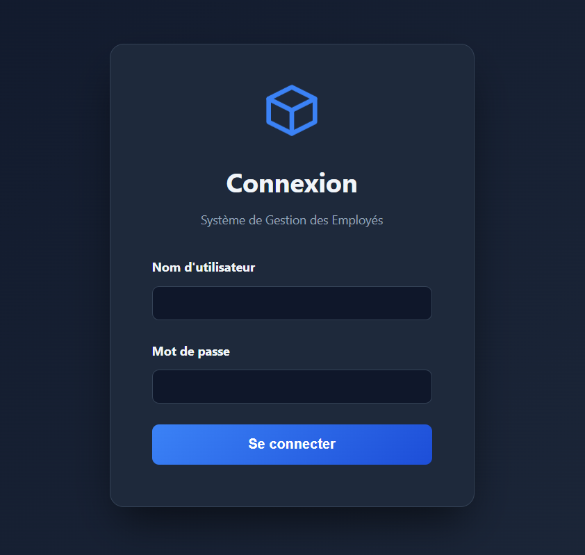
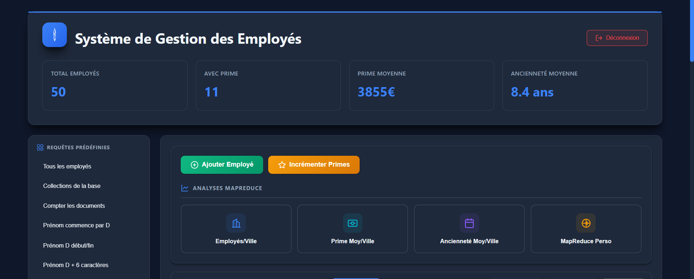
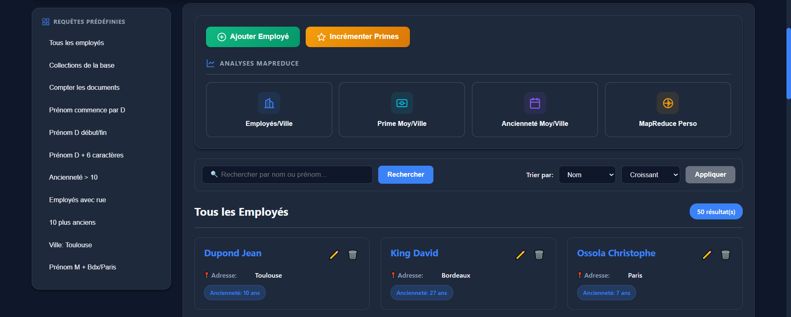
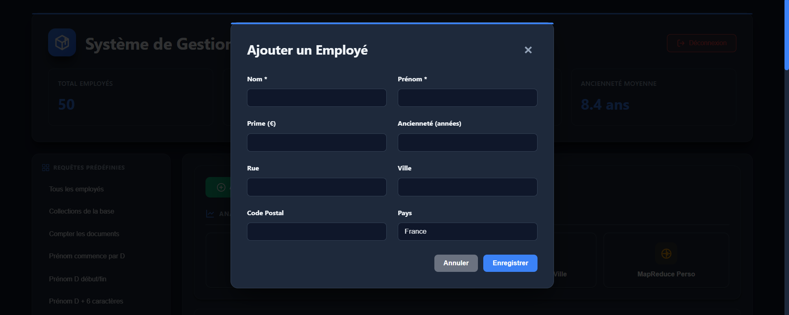
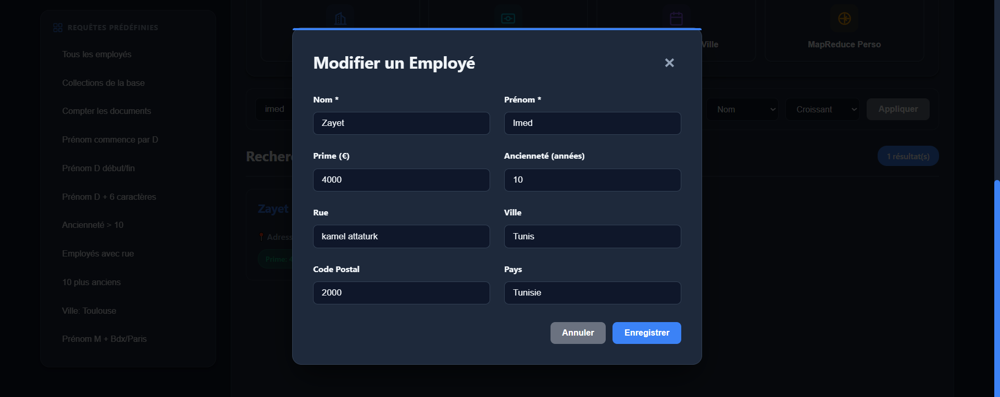
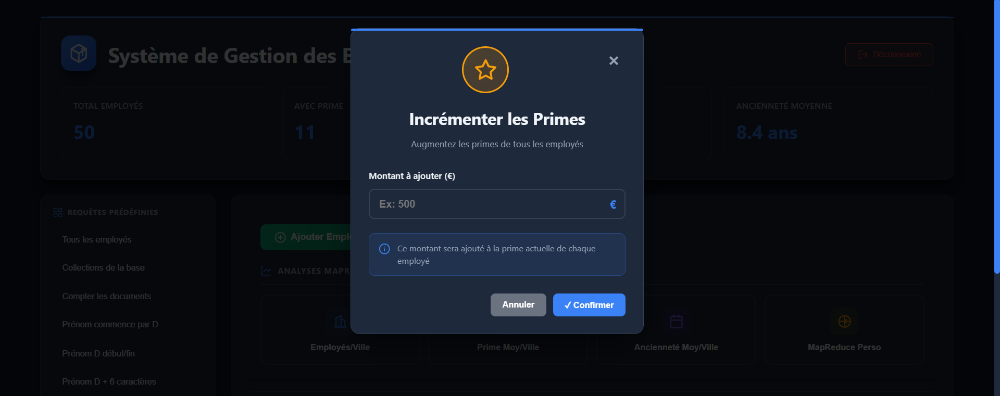
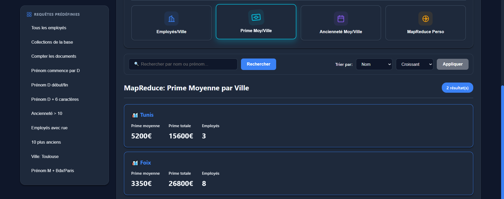
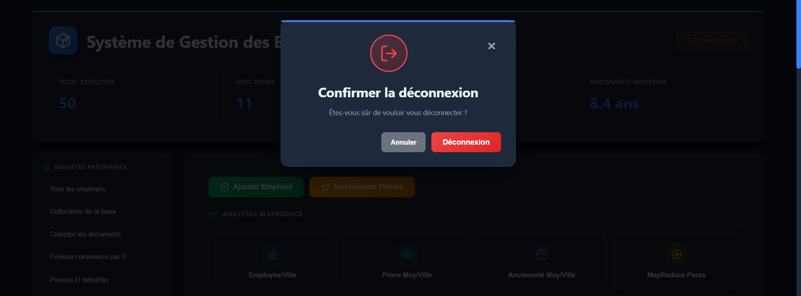

🎓 Projet Académique — Système de Gestion des Employés

Application web de gestion d'employés avec MongoDB, Node.js et MapReduce.

## 👥 Auteurs
- **Imed Zayet**
- **Maher Bouadila**

## 📑 Table des matières
- [Aperçu de l'application](#-aperçu-de-lapplication)
- [Installation](#-installation)
  - [Prérequis](#prérequis)
  - [Étapes d'installation](#étapes-dinstallation)
- [Connexion](#-connexion)
- [Structure du projet](#-structure-du-projet)
- [Configuration](#️-configuration)
- [Fonctionnalités](#-fonctionnalités)
  - [CRUD Complet](#-crud-complet)
  - [Requêtes Prédéfinies](#-requêtes-prédéfinies)
  - [Analyses MapReduce](#-analyses-mapreduce)
  - [Opérations de masse](#-opérations-de-masse)
- [Notes importantes](#-notes-importantes)
- [Dépannage](#-dépannage)

---

## 🖼️ Aperçu de l'application

### Écran d'accueil


### Interface de connexion


### Tableau de bord principal



### Gestion des employés

#### Ajout d'un employé


#### Modification d'un employé


### Opérations sur les primes


### Analyses MapReduce

#### Prime moyenne par ville


#### MapReduce personnalisé


### Déconnexion


---

## 🚀 Installation

### Prérequis
- Node.js (v14 ou supérieur)
- MongoDB (installé et en cours d'exécution)

### Étapes d'installation

1. **Cloner le projet**
```bash
git clone <url-du-repo>
cd Projet_Emp
```

2. **Installer les dépendances**
```bash
npm install
```

3. **Démarrer MongoDB**
```bash
# Assurez-vous que MongoDB est en cours d'exécution
mongod
```

4. **Importer les données (si nécessaire)**
```bash
# Si vous avez un fichier employes.bson
mongorestore --db gescom --collection employes employes/employes.bson
```

5. **Démarrer l'application**
```bash
npm start
```

6. **Ouvrir dans le navigateur**
```
http://localhost:3000
```

## 🔑 Connexion

- **Nom d'utilisateur** : `admin`
- **Mot de passe** : `*admin159!!`

## 📁 Structure du projet

```
Projet_Emp/
├── public/              
│   ├── index.html      
│   ├── app.js          
│   ├── styles.css      
│   ├── imed.png        
│   └── maher.png       
├── employes/           
│   ├── employes.bson
│   └── employes.metadata.json
├── server.js           
├── package.json        
└── README.md          

```

## ⚙️ Configuration

Par défaut, l'application utilise :
- **Port** : 3000
- **Base de données** : gescom
- **Collection** : employes
- **MongoDB URI** : mongodb://localhost:27017

Pour modifier, éditez `server.js` :
```javascript
const PORT = 3000;
const DB_NAME = 'gescom';
const COLLECTION_NAME = 'employes';
```

## 🎯 Fonctionnalités

### ✅ CRUD Complet
- Ajouter des employés
- Modifier les informations
- Supprimer des employés
- Recherche et filtrage

### 📊 Requêtes Prédéfinies
- Tous les employés
- Employés par critères (prénom, ancienneté, ville, etc.)
- Top 10 plus anciens

### 📈 Analyses MapReduce
- Employés par ville
- Prime moyenne par ville
- Ancienneté moyenne par ville
- MapReduce personnalisé 

### 💰 Opérations de masse
- Incrémentation des primes de tous les employés

## 📝 Notes importantes

### 💾 Données MongoDB
Les données sont dans le dossier `employes/` :
- Incluez ces fichiers si vous voulez partager les données
- Sinon, créez vos propres données via l'interface

## 🐛 Dépannage

### Le serveur ne démarre pas
```bash
# Vérifier que MongoDB est en cours d'exécution
mongosh

# Vérifier le port 3000 n'est pas utilisé
netstat -ano | findstr :3000
```

### Erreur de connexion MongoDB
- Assurez-vous que MongoDB est démarré
- Vérifiez l'URI de connexion dans `server.js`

### Les données ne s'affichent pas
- Vérifiez le nom de la base de données et de la collection
- Importez les données avec `mongorestore`


